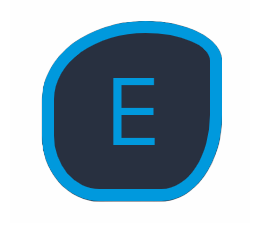

<a name="readme-top"></a>

<div align="center">
  <!-- You are encouraged to replace this logo with your own! Otherwise you can also remove it. -->
  
  <br/>

  <h3><b>Welcome to my project</b></h3>

</div>

<!-- TABLE OF CONTENTS -->

# 📗 Table of Contents

- [📖 About the Project](#about-project)
  - [🛠 Built With](#built-with)
    - [Tech Stack](#tech-stack)
    - [Key Features](#key-features)
  - [🚀 Live Demo](#live-demo)
  - [🚀 Presentation Demo](#presentation-demo)
- [💻 Getting Started](#getting-started)
  - [Setup](#setup)
  - [Prerequisites](#prerequisites)
  - [Install](#install)
  - [Usage](#usage)
  - [Run tests](#run-tests)
  - [Deployment](#deployment)
- [👥 Authors](#authors)
- [🔭 Future Features](#future-features)
- [🤝 Contributing](#contributing)
- [⭐️ Show your support](#support)
- [🙏 Acknowledgements](#acknowledgements)
- [📝 License](#license)

<!-- PROJECT DESCRIPTION -->

# 📖 [Animore] <a name="about-project"></a>

**[Animore]** "An immersive React-based web app for exploring and discovering a wide range of anime, offering a seamless user experience with comprehensive information and Check details functionality, I used tailwind to style the web app."

## 🛠 Built With <a name="built-with"></a>

### Tech Stack <a name="tech-stack"></a>

<details>
  <summary>Client</summary>
  <ul>
    <li><a href="https://reactjs.org/">React.js</a></li>
  </ul>
  <ul>
    <li><a href="https://reactjs.org/">Tailwind.css</a></li>
  </ul>
</details>


<!-- Features -->

### Key Features <a name="key-features"></a>

- **[Discover anime list filtred by categories]**
- **[Check details about each anime]**

<p align="right">(<a href="#readme-top">back to top</a>)</p>

<!-- LIVE DEMO -->

## 🚀 Live Demo <a name="live-demo"></a>

- [View Live Demo](https://react-capstone-vt4h.onrender.com/)

<p align="right">(<a href="#readme-top">back to top</a>)</p>

<!-- PRESENTATION DEMO -->

## 🚀 Presentation Demo <a name="presentation-demo"></a>

- [View Presentaion Demo](https://www.loom.com/share/84401a6bd6504e7685515490f8e532bd?sid=92a7eca8-1b1d-45da-bbb1-64444c7b4425)

<p align="right">(<a href="#readme-top">back to top</a>)</p>

<!-- GETTING STARTED -->

## 💻 Getting Started <a name="getting-started"></a>

### Prerequisites

In order to run this project you need to run:

```sh
 npm run start 
```

### Setup

Clone this repository to your desired folder using these commands:

```sh
 $ git clone https://github.com/otmaneechchafyky/react-capstone-project.git
 $ cd react-capstone-project
```

 ### Install

Install this project with by running:


```sh
  cd react-capstone-project
  gem install
```

### Run tests

To run tests, run the following command:

```sh
  npm test [file name]
```

### Deployment

You can deploy this project using:

Example:

```sh
  - Render
  - Netlify
```

<p align="right">(<a href="#readme-top">back to top</a>)</p>

<!-- AUTHORS -->

## 👥 Authors <a name="authors"></a>


👤 **Otmane Echchafyky**

- GitHub: [@otmaneechchafyky](https://github.com/otmaneechchafyky)
- Twitter: [@EchchafykyO](https://twitter.com/EchchafykyO)
- LinkedIn: [otmane-echchafyky](https://www.linkedin.com/in/otmane-echchafyky/)

<p align="right">(<a href="#readme-top">back to top</a>)</p>

<!-- FUTURE FEATURES -->

## 🔭 Future Features <a name="future-features"></a>

- **[Adding option to add more favorite animes]**
- **[Adding option to like and dislike a specific anime]**

<p align="right">(<a href="#readme-top">back to top</a>)</p>

<!-- CONTRIBUTING -->

## 🤝 Contributing <a name="contributing"></a>

Contributions, issues, and feature requests are welcome!

Feel free to check the [issues page](https://github.com/otmaneechchafyky/react-capstone-project/issues).

<p align="right">(<a href="#readme-top">back to top</a>)</p>

<!-- SUPPORT -->

## ⭐️ Show your support <a name="support"></a>

If you like this project give it a ⭐️ to keep us motivated.

<p align="right">(<a href="#readme-top">back to top</a>)</p>

<!-- ACKNOWLEDGEMENTS -->

## 🙏 Acknowledgments <a name="acknowledgements"></a>


I would like to thank Microverse community for support and Nelson sakwa for the great design.

<p align="right">(<a href="#readme-top">back to top</a>)</p>

<!-- LICENSE -->

## 📝 License <a name="license"></a>

This project is [MIT](./LICENSE) licensed.

<p align="right">(<a href="#readme-top">back to top</a>)</p>
